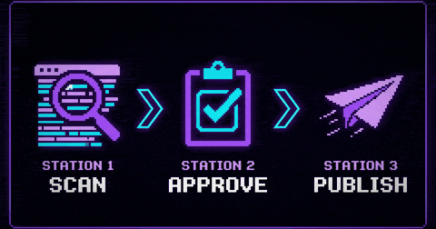

<p align="center">
  
</p>

<h1 align="center">linkedin-engage</h1>

<p align="center">
  <strong>Draft LinkedIn comments in your voice. Approve in Notion. Publish like a human.</strong>
</p>

<p align="center">
  <em>Every comment requires a human click in Notion before it publishes.<br>
  The 15-comments-a-day cap is hardcoded, not a setting.</em>
</p>

<p align="center">
  
  
  
</p>

<p align="center">
  <a href="#what-it-does">What it does</a> ·
  <a href="#who-this-is-for">Who it's for</a> ·
  <a href="#quick-start">Quick start</a> ·
  <a href="#what-this-is-not">What this is NOT</a> ·
  <a href="#how-it-compares">vs Taplio / Engage AI / Aware</a> ·
  <a href="#reference">Reference</a>
</p>

---

## What it does

<p align="center">
  
</p>

You want to show up consistently in other people's LinkedIn comments. The honest way takes 30-40 minutes of scrolling a day. The "automated" way turns you into a Taplio bot praising someone's Q3 wins.

This tool sits in the middle. **It drafts. You approve. Then it publishes — at human speed, capped at 15/day, never without your click.** If you don't open Notion, nothing ships.

> _Screenshot of the Notion approval queue → `assets/notion-queue.png` (todo)_

## Who this is for

- Founders, operators, and consultants growing a personal brand on LinkedIn
- People who can paste three commands into a terminal but aren't software engineers
- Anyone who already hates LinkedIn slop and refuses to add to it
- Single-operator use only — not designed to manage other people's accounts

If you want a managed SaaS that posts for you, use [Taplio](https://taplio.com) or [Engage AI](https://engage-ai.co). If you want control, voice fidelity, no monthly bill, and a hard human-in-the-loop — keep reading.

## Quick start

```bash
git clone https://github.com/dancolta/linkedin-engage && cd linkedin-engage
npm install && npx playwright install chromium
npm install -g @anthropic-ai/claude-code     # if you don't have it

cp .env.example .env                         # fill NOTION_TOKEN + NOTION_DB_ID
npm run voice:init                           # 15-question wizard → your voice profile
npm run setup                                # verifies Notion + Claude CLI + Chrome login

npm run scan                                 # scrape + draft + queue to Notion
# approve drafts in Notion (~10-15 min)
npm run publish                              # like + comment + archive, capped at 15/day
```

For the Notion DB you need to create first, see [Notion DB setup](#user-content-notion-db-setup) below.

> Runs headless by default so it doesn't steal focus. Set `LINKEDIN_HEADED=1` to watch the browser (useful for debugging). `setup` always runs headed since you log into LinkedIn manually once.

## What this is NOT

To keep us honest, and to save you the read if this isn't the tool you're looking for:

- **Not auto-comment.** Every comment is approved by you in Notion before it publishes.
- **Not a Taplio / Engage AI replacement.** No AI-ghostwriting your feed. No cloud. No subscription.
- **Not "set and forget."** If you don't review Notion, nothing ships.
- **Not a growth hack.** Hard 15/day cap. No DM blasts. No connection spam. No follower farming. No engagement pods.
- **Not multi-account.** Single operator. Not built for agencies running 50 client logins.
- **Not a SaaS.** Runs on your laptop, your Chrome session, your cookies. Nothing leaves your machine except the LinkedIn comments you approved.

## <a id="how-it-compares"></a>How this compares to Taplio, Engage AI, and Aware

Those are SaaS products: cloud-hosted, subscription-priced, and they hold the publish button. This tool is none of those things. Pick the one that matches how you want to work.

|  | linkedin-engage | Taplio / Engage AI / Aware |
|---|---|---|
| Hosting | Your laptop | Their cloud |
| Approval | Notion queue, you approve every comment | Auto-publish or in-app queue |
| Voice | Generated from your writing samples, runs locally via Claude | Generic tone presets, in-product fine-tune |
| Price | Free (uses your Claude subscription, no API key) | $39–$149 / month |
| Daily cap | Hard 15, phased ramp from 5 | Varies, often uncapped |
| Account risk control | Human-paced typing, manual approval, 14-day same-author cooldown | Depends on tool; shared cloud IPs raise flag rate |
| Setup time | ~10 minutes | ~2 minutes (it's SaaS) |

If you want a managed product, the SaaS options work. If you want a tool where _you_ are the bottleneck on purpose, this is it.

## Targeting (what gets drafted)

Four optional `.env` vars. Pipe-separated, case-insensitive substring match. Filters apply **before** the Claude call (saves tokens and time).

| Var | Effect |
|---|---|
| `ONLY_AUTHORS` | Whitelist. Only draft for these authors. |
| `SKIP_AUTHORS` | Blacklist. Never draft for these. |
| `ONLY_KEYWORDS` | Topic whitelist. Post text must contain one. |
| `SKIP_KEYWORDS` | Topic blacklist. Skip if post contains any. |

Example for an indie founder writing about B2B SaaS:

```env
ONLY_KEYWORDS=b2b saas|gtm|pricing|onboarding|founder-led sales
SKIP_KEYWORDS=hot take|grateful to announce|crypto|nft|web3
SKIP_AUTHORS=hustle bro|crypto guru|cold outreach guru
```

Skipped posts surface in the scan summary so you can tune the lists.

## AI drafting in your voice

`npm run voice:init` runs a 15-question wizard (identity, tone register, writing samples, topics you care about, what annoys you about LinkedIn) and shells to `claude -p` to synthesize `src/ai/voice-profile.md` — the personalized prompt the drafter uses for every comment.

```bash
npm run voice:init    # generate / regenerate voice profile
npm run voice         # open voice-profile.md for hand-tweaks
npm run draft:test -- "<paste a real post>"   # sanity check
```

Re-run `voice:init` anytime — your previous answers preload as defaults so you can iterate fast. The profile is gitignored; it stays on your machine.

<details>
<summary><strong>The 15 questions (click to expand)</strong></summary>

**Identity**

1. Your full name
2. Your role / title (e.g., "Founder", "Senior PM", "Indie hacker")
3. Company name (or leave blank if independent)
4. One-line bio — how you describe what you do (~10–20 words)

**Voice register**

5. Pick 3 words that describe how you write online (e.g., direct, witty, technical, warm, formal, sarcastic, dry, contrarian, earnest, playful)
6. Default casing in your writing — `lowercase` / `mixed` / `proper`
7. Swearing in your comments — `never` / `rare` / `often`
8. Sarcasm level (1 = earnest, 10 = scorched earth)
9. Three writers/posters whose tone you'd happily borrow (LinkedIn / X / Substack / books)

**Substance**

10. Top 3 topics you'll comment on most (e.g., "B2B SaaS, GTM strategy, indie founders")
11. Your unique angle — what perspective do you bring others don't? (e.g., "ex-engineer turned PM", "indie founder shipping weekly")
12. Paste 2–3 short examples of YOUR actual writing — comments, tweets, paragraphs you're proud of. These anchor the model in real you.
13. What 3 things annoy you most about typical LinkedIn comments? (these get banned — e.g., "fake humility, name-dropping, calling everything a journey")

**Goals**

14. Why are you commenting? (build network / signal craft / find clients / learn / mix)
15. Who do you want to attract? Be specific. (e.g., "founders running 10–50 person SaaS", "design directors at agencies")

> Answers persist to `~/.linkedin-engage/voice-answers.json` and preload as defaults on re-run, so iterating on your voice profile is fast.

</details>

## What this deliberately does not do

Daemon mode. Auto-publish. Cloud hosting. DM outreach. Multi-account management. All deliberately not built — they'd either cost account safety, defeat manual approval, or turn this into a different tool.

---

## <a id="reference"></a>Reference

Everything below is for the curious or the troubleshooting. Most users never need to touch any of it.

<details id="edge-cases-and-guardrails">
<summary><strong>Behavioral safeguards</strong> — three layers of human-in-the-loop checks</summary>

A post must pass all three layers to make it to your LinkedIn. The first two run before any comment is even drafted — saving you tokens, time, and risk.

#### Layer 1 — Pre-draft filters (run on every scraped post, before any AI call)

| Filter | Rule | Why |
|---|---|---|
| Post too short | `<50 chars` | Not enough to react to |
| Job or poll | heuristic | Wrong content type for a comment |
| Stale post | `ageDays > 7` | Old news, low signal |
| Drowned post | `commentCount > 150` | Your comment vanishes in the noise |
| Already seen | SQLite dedup | Cross-run, prevents re-queue |
| Same author <14 days | SQLite history | Cooldown — looks robotic otherwise |
| `SKIP_AUTHORS` / `SKIP_KEYWORDS` | env var match | Your blocklist |
| `ONLY_AUTHORS` / `ONLY_KEYWORDS` | env var miss | Your allowlist filter |
| Author already pending in Notion | live query | Don't double-queue |
| Non-English post | language heuristic | <75% Latin chars OR zero English stopwords |

#### Layer 2 — Drafter output validation (after AI, before Notion)

| Check | Rejects if |
|---|---|
| Drafter abstained | Output literally equals `SKIP` |
| Length | `<30` or `>280` characters |
| Exclamation marks, hashtags, emoji, em/en dashes | Any present (LinkedIn-AI tells) |
| Antithesis structure | `not X, Y` / `it's not X. it's Y` / `less X, more Y` (classic AI cadence) |
| Banned opener | First word matches any of 24 phrases ("great post", "love this", "hot take", …) |
| Banned anywhere | 22 sludge phrases ("curious", "leverage", "synergy", "game-changer", …) |
| Opener repeats | First 4 words match any of last 20 published comments |

#### Layer 3 — Pre-publish re-checks (immediately before each comment ships)

| Check | Action |
|---|---|
| `LINKEDIN_PAUSE=1` or `~/.linkedin-engage/PAUSED` flag | Exit immediately |
| Daily cap already hit | Defer remaining rows, exit |
| Pre-flight account health check | Load `/feed/`, scan for restriction language → on hit, screenshot + write PAUSED + exit code 2 |
| Re-validate your edited text | Final text goes through guardrails again |
| 14-day same-author re-check | Skip if author was published since draft was approved |
| 3 publish failures in 1h | Auto-write PAUSED, halt batch |

Full source: [`src/scan.ts`](src/scan.ts) (Layer 1), [`src/ai/guardrails.ts`](src/ai/guardrails.ts) (Layer 2), [`src/publish.ts`](src/publish.ts) (Layer 3).

</details>

<details>
<summary><strong>Account safety</strong> — volume caps and kill switches</summary>

LinkedIn's anti-spam systems penalize three patterns: duplicate text, mass action on the same target, and machine-regular intervals. The 14-day same-author cooldown, the per-comment manual approval, and the volume caps below address those directly. They're behavioral, not fingerprint-based.

| Phase | Days since first run | Daily cap | Gap between publishes |
|---|---|---|---|
| Ramp | 1-3 | 5 | 45-120s |
| Build | 4-7 | 10 | 30-90s |
| Steady | 8+ | 15 | 30-90s |

**Why those gaps:** real engaged users comment 5-10 times in a 10-15 min reading session. Long, regular cooldowns (e.g. always 6-15 min) look mechanical. The range above mimics natural feed-engagement bursts. The daily cap is the actual safety lever.

#### Kill switches

Any one of these halts both `scan` and `publish`:

```bash
LINKEDIN_PAUSE=1 npm run publish        # env var (one-shot)
touch ~/.linkedin-engage/PAUSED         # flag file (persists across runs)
                                        # automatic — written when 3 publishes fail
                                        # in any 1h window, or restriction language
                                        # is detected on /feed/
```

To resume after manual investigation: `rm ~/.linkedin-engage/PAUSED`.

#### Browser session

The tool uses Playwright's bundled Chromium with a real persistent profile at `~/.linkedin-engage/chrome-profile/`. Your LinkedIn cookies live there and survive across runs. Headless by default so the browser doesn't steal focus; `LINKEDIN_HEADED=1` to watch it for debugging. Typing is 35-90ms per keystroke with 4% mid-word pauses. Scroll uses 200-600px steps and 1.5-4s pauses. Mouse clicks have ±3px jitter. None of this matters as much as the behavioral safeguards above — it's there because there's no reason to ignore the small wins.

</details>

<details>
<summary><strong>Failure modes & recovery</strong></summary>

| Symptom | What you'll see | Recovery |
|---|---|---|
| Not logged into Chrome profile | `Scraped 0 posts. Check ~/Downloads/...png` | Run `npm run setup`, log into LinkedIn in the Playwright Chrome window, close it |
| LinkedIn shipped new selectors | `(N posts skipped — no URN extractable)` | Open `src/linkedin/feed-scraper.ts`, update selectors |
| Submit button stays disabled | `✗ Failed: submit button not found or still disabled after typing` | Likely typing didn't hit the editor — inspect screenshot at `~/Downloads/linkedin-incident-no-submit-button-*.png` |
| Transient browser hiccup | `⚠ Infra error (...) — recovering page and retrying once` | Auto-recovered: `publish.ts` swaps in a fresh page, waits 15-40s, retries once. If retry still fails, row is re-set to `approved` for the next run |
| Notion 404 on data source | `Could not find database with ID: <ds_id>` | In Notion: DB → `...` → Connections → add the integration |
| Restriction banner detected | `ACCOUNT PAUSED: <signal>` + exit code 2 | Open the screenshot, log into LinkedIn manually, address the verification, then `rm ~/.linkedin-engage/PAUSED` |
| Claude usage limit hit | `Usage limit hit. Stopping.` | Wait for subscription quota reset |

All Playwright incidents save a full-page screenshot to `~/Downloads/linkedin-incident-<reason>-<timestamp>.png`.

</details>

<details id="notion-db-setup">
<summary><strong>Notion DB setup</strong> — schema + integration share</summary>

#### Field schema (exact names + types — typos cause `object_not_found`)

| Field | Type | Used for |
|---|---|---|
| `Name` | Title | "&lt;author&gt; — &lt;40 chars&gt;" preview |
| `post_url` | URL | Canonical LinkedIn post URL |
| `author` | Text | Post author |
| `post_text` | Text | Original post body |
| `screenshot` | Files | Optional post screenshot |
| `draft` | Text | Auto-generated comment |
| `final_text` | Text | Optional — your edits land here. If blank, `draft` is published |
| `status` | Select | `pending`, `approved`, `publishing`, `published`, `failed`, `skipped`, `deferred` |
| `reason` | Text | Filled by the tool on skip/fail/defer |
| `scanned_at` | Date | When the drafter ran |
| `published_at` | Date | When the comment went live |

#### Share the DB with an integration

1. Create a Notion integration at https://www.notion.so/profile/integrations → copy the secret. That's your `NOTION_TOKEN`.
2. Open your DB → `...` menu → **Connections** → add the integration.
3. Copy the 32-char ID from the DB URL (`https://www.notion.so/<DB_ID>?v=...`). That's your `NOTION_DB_ID`.

#### After a successful publish

Status flips to `published`, then the row is **auto-archived** (hidden from default views, recoverable for 30 days via Notion's restore). Keeps your queue clean without losing history.

</details>

<details>
<summary><strong>How it runs under the hood</strong></summary>

```
npm run scan
  1. Launch Chromium with the real persistent profile (headless by default)
  2. Navigate to /feed/, wait for the main feed to render
  3. Scroll, extract posts via stable selectors (listitem wrapper, aria-label
     author name, expandable-text-box body, protobuf-decoded activity URN)
  4. Close Chrome (release profile lock so publish can use it later)
  5. Apply Layer 1 filters to every scraped post
  6. ONE batched `claude -p` call drafts all eligible posts as JSON array
  7. Validate each draft against Layer 2 guardrails
  8. Push survivors to Notion as status=pending

[ you approve drafts in Notion ]

npm run publish
  1. Pre-flight account health check (Layer 3 starts here)
  2. For each approved row, with cooldown gaps:
        re-check guardrails →
        navigate to post URL →
        click Like (if not already liked) →
        wait, type comment at 35-90ms/keystroke →
        click submit, verify editor cleared
  3. On success: status=published, archive Notion row, record SQLite history
  4. On transient infra error: swap page, wait 15-40s, retry once;
     if still failing, re-set row to `approved` for next run
  5. On 3 consecutive failures in 1h: write PAUSED flag, halt
```

**Why this is cheap:**
- Single batched `claude -p` call per scan (voice profile sent once, not N times) — ~5x fewer tokens
- Chrome closed during the slow Claude call — no idle browser
- Cooldowns tuned to real human-engagement cadence, not paranoid long gaps

</details>

<details>
<summary><strong>Project layout</strong></summary>

```
linkedin-engage/
├── assets/demo.gif
├── src/
│   ├── scan.ts                          # entrypoint: scrape + batch-draft + queue
│   ├── publish.ts                       # entrypoint: read approved + like + publish + archive
│   ├── status.ts                        # entrypoint: counts + paused state
│   ├── setup.ts                         # entrypoint: verifies Notion / Claude CLI / voice / Chrome
│   ├── voice-init.ts                    # entrypoint: 15-question voice wizard
│   ├── draft-test.ts                    # offline drafter sanity test
│   ├── config.ts                        # env, paths, phase calc, cooldown config
│   ├── ai/
│   │   ├── drafter.ts                   # batched `claude -p` shell-out with JSON output
│   │   ├── guardrails.ts                # length, banned phrases, em-dash, antithesis, opener-match
│   │   ├── language.ts                  # English detector
│   │   ├── voice-profile.template.md    # committed: skeleton + verbatim universal rules
│   │   └── voice-profile.md             # gitignored: YOUR generated voice (per-user)
│   ├── linkedin/
│   │   ├── browser.ts                   # Playwright launchPersistentContext + human delays
│   │   ├── feed-scraper.ts              # scroll, URN decoder, extract posts
│   │   ├── commenter.ts                 # like + clear-draft + type + submit + verify
│   │   └── safety-check.ts              # restriction detection, paused-flag mgmt
│   ├── notion/
│   │   ├── client.ts                    # @notionhq/client wrapper
│   │   └── queue.ts                     # createPending, listApproved, archivePage
│   ├── cache/sqlite.ts                  # ~/.linkedin-engage/state.db
│   └── tools/                           # one-off utilities
└── package.json
```

#### Gitignored vs committed

| Path | Status | Why |
|---|---|---|
| `.env` | gitignored | Holds your Notion token + DB ID |
| `src/ai/voice-profile.md` | **gitignored** | Personal — generated by `voice:init` |
| `src/ai/voice-profile.template.md` | committed | Template + universal rules; same for everyone |
| `chrome-profile/` | gitignored | LinkedIn cookies, persistent browser state |
| `state.db` | gitignored | SQLite cache: dedup, daily counter, recent comments |
| `~/.linkedin-engage/voice-answers.json` | outside repo | Your wizard answers (so you can re-run + iterate) |
| `~/.linkedin-engage/PAUSED` | outside repo | Kill-switch flag |

</details>

<details>
<summary><strong>Optional: Claude Code skill wrapper</strong></summary>

If you use [Claude Code](https://docs.claude.com/en/docs/claude-code/overview) and want to trigger the worker via slash-command instead of `npm run`, drop a thin skill wrapper into `~/.claude/skills/`. Not bundled with the repo (lives outside the project, per-machine).

```bash
mkdir -p ~/.claude/skills/linkedin-engage
$EDITOR ~/.claude/skills/linkedin-engage/SKILL.md
```

Paste this in (replace `<path-to-repo>` and `<your_db_id>`):

```markdown
# /linkedin-engage

Thin wrapper over the linkedin-engage project at <path-to-repo>.

## Args
- `run` (or no arg) → scan + draft + queue to Notion
- `post` → publish whatever you approved in Notion
- `status` → counts, today's published, paused state
- `setup` → first-time install: verify Notion, Claude CLI, log into LinkedIn

## Execution
| Arg | Command |
|---|---|
| `run` (default) | `cd <path-to-repo> && npm run scan` |
| `post` | `cd <path-to-repo> && npm run publish` |
| `status` | `cd <path-to-repo> && npm run status` |
| `setup` | `cd <path-to-repo> && npm run setup` |

Stream output. Use a 10-minute timeout for `run` and `post`.

## After completion
- `run`: scraped/queued/skipped counts + Notion DB URL for review
- `post`: published/failed/deferred counts. If any failed/deferred, surface why
- `status`: phase, today's count vs cap, paused state, queue counts

## Critical: account safety signals
If output contains `ACCOUNT PAUSED`, `RESTRICTION`, `CAPTCHA`, `LOGIN_REQUIRED`, or exit code 2:
- DO NOT retry. Halt.
- Tell the user: "LinkedIn safety check failed. Open `~/Downloads/linkedin-incident-*.png`. After confirming the account is healthy, delete `~/.linkedin-engage/PAUSED` to resume."
```

After saving, the skill is available as `/linkedin-engage run|post|status|setup`. Restart Claude Code if it doesn't show up.

</details>

## Stack & self-hosting requirements

Node 20+ · TypeScript (ESM via tsx) · Playwright (headless Chromium) · `@notionhq/client` · `better-sqlite3` · `claude` CLI for drafting (uses your existing Claude subscription, no API key needed)

Runs entirely on your laptop. The only outbound calls are to LinkedIn (the comments you approved), Notion (your private DB), and Anthropic (your Claude account).

## FAQ

**Will this get my account banned?**
That's the honest risk with any third-party tool that touches LinkedIn. This one is built to minimize the patterns LinkedIn's anti-spam actually penalizes: no auto-publish, no duplicate text (every draft is unique), 14-day cooldown on the same author, hard 15/day cap, human-paced typing, real persistent Chrome profile. Read the [disclaimer](#disclaimer) before installing.

**Do my drafts sound like me, or like ChatGPT?**
The `voice:init` wizard asks you 15 questions including writing samples and what annoys you about LinkedIn. Then a guardrail layer rejects 46 known AI-tell phrases ("curious", "leverage", "game-changer", em-dashes, antithesis structures, etc.) before drafts reach Notion. You can also hand-edit `src/ai/voice-profile.md` directly.

**Where does my data live?**
Everything is local. LinkedIn cookies in `~/.linkedin-engage/chrome-profile/`. Voice profile in `src/ai/voice-profile.md` (gitignored). Drafts in your private Notion DB. SQLite cache in `~/.linkedin-engage/state.db`. The only thing that leaves your machine is the comment you approved and the prompt to Claude.

**Can I use this for multiple LinkedIn accounts?**
No. Single-operator, single-profile by design. Running it against accounts you don't own crosses into TOS territory the disclaimer specifically rules out.

**What does it cost to run?**
Free, if you already pay for Claude (Pro or Max subscription). A scan of ~25 posts costs roughly the same as one Claude conversation since drafting is batched into a single call.

---

## License

MIT. See [LICENSE](LICENSE).

## <a id="disclaimer"></a>Disclaimer

LinkedIn's [User Agreement §8.2](https://www.linkedin.com/legal/user-agreement) restricts automation and scraping. This tool automates parts of your LinkedIn use, so it falls under that restriction. Manual approval and human-paced typing keep the behavioral footprint low, but the risk of restrictions or account action is real and entirely on you.

Use only on accounts you personally own. Not for mass outreach. Not for managing other people's accounts. Provided as-is, no warranty, no support.

By cloning, installing, or running this code you accept these terms.

---

> Built by [NodeSparks](https://www.nodesparks.com) — [custom automation that replaces recurring SaaS](https://www.nodesparks.com/services/ai-automation-agency), operator-built and human-in-the-loop.
