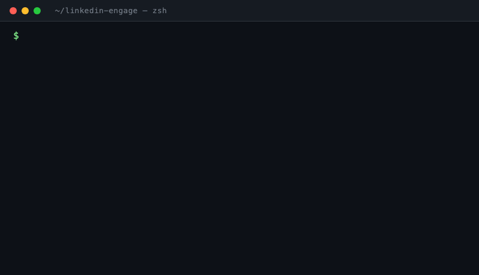

<p align="center">
  
</p>

<h1 align="center">linkedin-engage</h1>

<p align="center">
  <strong>Auto-draft LinkedIn comments in your voice. Approve in Notion. Publish on a real Chrome profile. Never get flagged.</strong>
</p>

<p align="center">
  
  
  
  
  
</p>

---

## Why this exists

LinkedIn's feed is mostly slop. AI-generated motivational posts, engagement bait, recycled hot takes, broetry stacks. Filtering manually for posts worth a reply means scrolling 30-40 minutes a day, mostly through stuff that doesn't deserve a reaction.

Full automation makes things worse — auto-comment bots turn LinkedIn into bots talking to bots, and your account is one of them.

This tool sits in the middle. **You** define what posts matter (keywords, authors). **The tool** scrapes, drafts in your voice, queues to Notion. **You** read each post, edit if needed, publish in batch. **10-15 min instead of 30-40.** You see every comment before it goes live.

## The loop

```
1. npm run scan      → scrape feed, apply your filters, draft in your voice, queue to Notion
2. you approve       → in Notion: read post, tweak draft, flip status to "approved"
3. npm run publish   → like the post, type the comment at human speed, archive the row
```

No daemon. No auto-publish. No "5-min undo" magic. Every comment passes through your eyes.

## Quick start

```bash
git clone https://github.com/dancolta/linkedin-engage && cd linkedin-engage
npm install && npx playwright install chromium
npm install -g @anthropic-ai/claude-code     # if you don't have it

cp .env.example .env                         # fill NOTION_TOKEN + NOTION_DB_ID
npm run voice:init                           # 15-question wizard → personalized voice profile
npm run setup                                # verifies Notion + claude CLI + Chrome login

npm run scan                                 # scrape + draft + queue
# approve drafts in Notion
npm run publish                              # like + publish + auto-archive
```

For the Notion DB you need to create, see the [Notion DB setup](#user-content-notion-db-setup) accordion below.

## Targeting (what gets drafted)

Four optional `.env` vars. Pipe-separated, case-insensitive substring match. Filters apply **before** the Claude call (saves tokens + time).

| Var | Effect |
|---|---|
| `ONLY_AUTHORS` | Whitelist. Only draft for these authors. |
| `SKIP_AUTHORS` | Blacklist. Never draft for these. |
| `ONLY_KEYWORDS` | Topic whitelist. Post text must contain one. |
| `SKIP_KEYWORDS` | Topic blacklist. Skip if post contains any. |

Example for an indie founder writing about B2B SaaS:

```env
ONLY_KEYWORDS=b2b saas|gtm|pricing|onboarding|founder-led sales
SKIP_KEYWORDS=hot take|grateful to announce|crypto|nft|web3
SKIP_AUTHORS=hustle bro|crypto guru|cold outreach guru
```

Skipped posts surface in the scan summary so you can tune the lists.

## Voice

`npm run voice:init` runs a 15-question wizard (identity, tone register, writing samples, topics, what annoys you about LinkedIn) and shells to `claude -p` to synthesize `src/ai/voice-profile.md` — the personalized prompt the drafter uses for every comment.

```bash
npm run voice:init    # generate / regenerate voice profile
npm run voice         # open voice-profile.md for hand-tweaks
npm run draft:test -- "<paste a real post>"   # sanity check
```

Re-run `voice:init` anytime — your previous answers preload as defaults so you can iterate fast.

## Out of scope

Daemon mode. Auto-publish. Cloud hosting. DM outreach. All deliberately not built — they'd either cost account safety or defeat manual approval.

> Runs headless by default so it doesn't steal focus from your other windows. Set `LINKEDIN_HEADED=1` in `.env` to watch the browser (useful for debugging selector drift). `setup` always runs headed since you need to log into LinkedIn manually.

---

## Reference

Detail below covers what's running under the surface. Most users never need to touch any of it.

<details id="edge-cases-and-guardrails">
<summary><strong>Edge cases & guardrails</strong> — three layers, ~30 filters</summary>

A post must pass all three layers to make it to your LinkedIn.

#### Layer 1 — Pre-draft filters (`scan.ts`, before any Claude call)

| Filter | Rule | Reason |
|---|---|---|
| Post too short | `<50 chars` | Not enough to react to |
| Job or poll | `isJobOrPoll` heuristic | Wrong content type |
| Stale post | `ageDays > 7` | Old news, low signal |
| Drowned post | `commentCount > 150` | Your comment vanishes in the noise |
| Already seen | `seen_posts` SQLite | Cross-run dedup, prevents re-queue |
| Same author <14 days | `author_history` SQLite | Looks robotic, may flag profile |
| `SKIP_AUTHORS` match | env var, substring | You don't want to engage with them |
| Not in `ONLY_AUTHORS` | env var, substring | If allowlist is set and author isn't on it |
| `SKIP_KEYWORDS` match | env var, substring on post text | Off-topic / engagement bait |
| No `ONLY_KEYWORDS` match | env var, substring on post text | If topic allowlist is set and post doesn't match |
| Same author this scan | in-batch `Set<author>` | Within-run dedup |
| Same author already pending | `listOpenAuthors()` Notion query | Approved/pending row exists, don't queue twice |
| Non-English post | `detectEnglish()` heuristic | <75% Latin chars OR zero English stopwords |

#### Layer 2 — Drafter output validation (`guardrails.ts`, before Notion write)

| Check | Rejects if |
|---|---|
| Drafter abstained | Output literally equals `SKIP` |
| Length min | `<30 chars` |
| Length max | `>280 chars` |
| Exclamation marks | Any `!` present |
| Hashtags | `#word` after start-of-string or whitespace (allows mid-word `f#ck` censored swears) |
| Unicode emoji | Any codepoint in emoji ranges |
| Em/en dash | Any `—` or `–` (use period/comma/semicolon instead) |
| Antithesis structure | `not X, Y` / `it's not X. it's Y` / `less X, more Y` / `isn't X, it's Y` patterns |
| Banned opener | First word matches any of 24 phrases (great post, love this, hot take, etc.) |
| Banned anywhere | 22 phrases (curious, leverage, synergy, game-changer, …) |
| Opener repeats | First 4 words match any of last 20 published comments |

#### Layer 3 — Pre-publish re-checks (`publish.ts`, immediately before each publish)

| Check | Action |
|---|---|
| `LINKEDIN_PAUSE=1` env | Exit immediately |
| `~/.linkedin-engage/PAUSED` file | Exit immediately |
| Daily cap already hit | Exit, mark remaining as `deferred` |
| Pre-flight health check | Load `/feed/`, scan body text for restriction language → if hit, screenshot + write PAUSED + exit code 2 |
| Re-validate edited text | Final text (after your manual edits) goes through guardrails again |
| 14-day same-author re-check | Mark `skipped` if author was published since draft was approved |
| Daily cap mid-batch | Defer remaining rows, exit cleanly |
| 3 publish failures in 1h | Auto-write PAUSED, halt batch |

#### Browser anti-detection

| Measure | Value |
|---|---|
| Browser binary | Playwright's bundled Chromium (Chrome for Testing) |
| `navigator.webdriver` | False (verified via DOM probe) |
| Args | `--disable-blink-features=AutomationControlled` |
| Profile | Real persistent context at `~/.linkedin-engage/chrome-profile/` |
| Cookies | Survive across runs (`li_at` cookie ~1 year TTL) |
| Viewport | 1440x900 (real laptop screen size) |
| Mode | Headless by default (no visible window, no focus theft); `LINKEDIN_HEADED=1` to debug. Both modes use the same persistent profile, fingerprint, and timings |
| Scroll | 200-600px steps, 1.5-4s pauses, 15% chance of back-scroll |
| Typing | 35-90ms per keystroke, 4% chance of mid-word pause (300-700ms), no paste |
| Mouse clicks | ±3px jitter around target coordinate |

#### Detection signals → halt + write PAUSED + screenshot

- Restriction banner detected on `/feed/` (8 signal phrases scanned)
- Redirect to `/checkpoint/` or `/uas/login` after action
- Captcha / verify-identity modal
- Comment editor not found after Comment-trigger click
- Submit button not found or stays disabled after typing
- Submit redirect (URL changed to checkpoint/login)
- Editor still contains the comment text after submit (publish silently failed)

</details>

<details>
<summary><strong>Account safety</strong> — volume caps and kill switches</summary>

Daily volume caps with phased ramp. The `seen_posts` table and 14-day same-author cooldown prevent the patterns LinkedIn's anti-spam actually penalizes — duplicate text, mass action on the same target, machine-regular intervals.

| Phase | Days since first run | Daily cap | Gap between publishes |
|---|---|---|---|
| Ramp | 1-3 | 5 | 45-120s |
| Build | 4-7 | 10 | 30-90s |
| Steady | 8+ | 15 | 30-90s |

**Why these timings:** real engaged users comment 5-10 times in a 10-15 min reading session. Earlier 6-15 min cooldowns made the pattern look mechanical (always a long, regular gap). The new range mimics natural feed-engagement bursts. Daily cap is the actual safety lever.

#### Kill switches

Any one of these halts both `scan` and `publish`:

```bash
LINKEDIN_PAUSE=1 npm run publish        # 1. env var
touch ~/.linkedin-engage/PAUSED      # 2. flag file (persists across runs)
                                        # 3. automatic — written when 3 publishes fail
                                        #    in any 1h window or restriction language
                                        #    is detected on /feed/
```

To resume after a manual investigation: `rm ~/.linkedin-engage/PAUSED`.

</details>

<details>
<summary><strong>Failure modes & recovery</strong></summary>

| Symptom | What you'll see | Recovery |
|---|---|---|
| Not logged into Chrome profile | `Scraped 0 posts. Check ~/Downloads/...png` | Run `npm run setup`, log into LinkedIn in the Playwright Chrome window, close it |
| LinkedIn shipped new selectors | `(N posts skipped — no URN extractable)` | Open `src/linkedin/feed-scraper.ts`, update selectors against latest DOM |
| Submit button stays disabled | `✗ Failed: submit button not found or still disabled after typing` | Likely typing didn't hit the editor — inspect screenshot at `~/Downloads/linkedin-incident-no-submit-button-*.png` |
| Transient browser hiccup (page/context closed, net::ERR_) | `⚠ Infra error (...) — recovering page and retrying once` | Auto-recovered — `publish.ts` swaps in a fresh page, waits 15-40s, retries once. If the retry still fails, the row is re-set to `approved` so the next `publish` run picks it up |
| Notion 404 on data source | `Could not find database with ID: <ds_id>` | In Notion, share the DB with your integration via DB → "..." → Connections |
| Restriction banner detected | `ACCOUNT PAUSED: <signal>` + exit code 2 | Open the screenshot, log into LinkedIn manually, address the verification, then `rm ~/.linkedin-engage/PAUSED` |
| Claude usage limit hit | `Usage limit hit. Stopping.` | Wait for subscription quota reset, retry |
| 3 consecutive publish failures | Auto-PAUSED with reason in flag file | Read flag (`cat ~/.linkedin-engage/PAUSED`), inspect screenshots, address root cause, delete flag |

All Playwright incidents save a full-page screenshot to `~/Downloads/linkedin-incident-<reason>-<timestamp>.png` for post-mortem.

</details>

<details id="notion-db-setup">
<summary><strong>Notion DB setup</strong> — schema + integration share</summary>

#### Field schema (exact names + types — typos cause `object_not_found`)

| Field | Type | Used for |
|---|---|---|
| `Name` | Title | "<author> — <40 chars>" preview |
| `post_url` | URL | Canonical LinkedIn post URL |
| `author` | Text | Post author |
| `post_text` | Text | Original post body |
| `screenshot` | Files | Optional post screenshot |
| `draft` | Text | Auto-generated comment |
| `final_text` | Text | Optional — your edits land here. If blank, `draft` is published |
| `status` | Select | Options: `pending`, `approved`, `publishing`, `published`, `failed`, `skipped`, `deferred` |
| `reason` | Text | Filled by the tool on skip/fail/defer |
| `scanned_at` | Date | When the drafter ran |
| `published_at` | Date | When the comment went live |

#### Share the DB with an integration

1. Create a Notion integration at https://www.notion.so/profile/integrations → copy the secret (this is `NOTION_TOKEN`)
2. Open your DB → `...` menu → **Connections** → add the integration
3. Copy the 32-char ID from the DB URL (`https://www.notion.so/<DB_ID>?v=...`) → that's `NOTION_DB_ID`

#### After a successful publish

Status flips to `published`, then the row is **auto-archived** (hidden from default views, recoverable for 30 days via Notion's restore). Keeps your queue clean without losing history.

</details>

<details>
<summary><strong>How it runs under the hood (pseudo-code)</strong></summary>

```
npm run scan
  1. Launch Chromium (real persistent profile, headless by default)
  2. Navigate to /feed/, wait for [data-testid="mainFeed"]
  3. Scroll the feed, extract posts via stable selectors:
         - listitem wrapper:  [role="listitem"]
         - author name:       aria-label="Open control menu for post by <name>"
         - post body:         [data-testid="expandable-text-box"]
         - activity URN:      protobuf-decoded from "componentkey" attribute
  4. Close Chrome (release profile lock for publish later)
  5. Filter eligible posts (Layer 1 above)
  6. ONE batched `claude -p` call drafts all eligible in a single JSON array
  7. Validate each draft against guardrails (Layer 2 above)
  8. Push survivors to Notion as status=pending

[ approve drafts in Notion (UI directly, or via Claude app + Notion MCP) ]

npm run publish
  1. Pre-flight account health check (load /feed/, scan for restriction language)
  2. For each approved row, with cooldown gaps:
         re-check guardrails →
         navigate to post URL →
         click Like (if not already pressed) →
         wait, type comment 35-90ms/key →
         click submit, verify editor cleared
  3. On success: status=published, archive Notion row, record SQLite history
  4. On transient infra error (page/context closed, net::ERR_): recover live page, retry once with 15-40s cooldown; if still fails, re-set row to `approved` for the next run
  5. On 3 consecutive failures in 1h: write PAUSED flag, halt
```

**Efficiency wins:**
- Single batched `claude -p` call (voice profile sent once, not N times) — ~5x token reduction
- Chrome closed before drafting — no idle browser during the slow Claude call
- Cooldowns tuned to real human-engagement cadence (45-120s ramp, not 6-15 min)

</details>

<details>
<summary><strong>Project layout</strong></summary>

```
linkedin-engage/
├── assets/demo.gif
├── src/
│   ├── scan.ts                          # entrypoint: scrape + batch-draft + queue
│   ├── publish.ts                       # entrypoint: read approved + like + publish + archive
│   ├── status.ts                        # entrypoint: counts + paused state
│   ├── setup.ts                         # entrypoint: verifies Notion / claude CLI / voice / Chrome
│   ├── voice-init.ts                    # entrypoint: 15-question voice wizard
│   ├── draft-test.ts                    # offline drafter sanity test
│   ├── config.ts                        # env, paths, phase calc, cooldown config
│   ├── ai/
│   │   ├── drafter.ts                   # batched `claude -p` shell-out with JSON output
│   │   ├── guardrails.ts                # length, banned phrases, em-dash, antithesis, opener-match
│   │   ├── language.ts                  # English detector
│   │   ├── voice-profile.template.md    # committed: skeleton + verbatim universal rules
│   │   └── voice-profile.md             # gitignored: YOUR generated voice (per-user)
│   ├── linkedin/
│   │   ├── browser.ts                   # Playwright launchPersistentContext + human delays
│   │   ├── feed-scraper.ts              # scroll, URN decoder, extract posts
│   │   ├── commenter.ts                 # like + clear-draft + type + submit + verify
│   │   └── safety-check.ts              # restriction detection, paused-flag mgmt
│   ├── notion/
│   │   ├── client.ts                    # @notionhq/client wrapper
│   │   └── queue.ts                     # createPending, listApproved, archivePage
│   ├── cache/sqlite.ts                  # ~/.linkedin-engage/state.db
│   └── tools/                           # one-off utilities
└── package.json
```

#### Gitignored vs committed

| Path | Status | Why |
|---|---|---|
| `.env` | gitignored | Holds your Notion token + DB ID |
| `src/ai/voice-profile.md` | **gitignored** | Personal — generated by `voice:init`, contains your name/role/samples |
| `src/ai/voice-profile.template.md` | committed | Template + verbatim universal rules; same for everyone |
| `chrome-profile/` | gitignored | LinkedIn cookies, persistent browser state |
| `state.db` | gitignored | SQLite cache: dedup, daily counter, recent comments |
| `~/.linkedin-engage/voice-answers.json` | outside repo | Your wizard answers (so you can re-run + iterate) |
| `~/.linkedin-engage/PAUSED` | outside repo | Kill-switch flag |

</details>

<details>
<summary><strong>Optional: Claude Code skill wrapper</strong></summary>

If you use [Claude Code](https://docs.claude.com/en/docs/claude-code/overview) and want to trigger the worker via slash-command instead of `npm run`, drop a thin skill wrapper into `~/.claude/skills/`. Not bundled with the repo (lives outside the project, per-machine).

```bash
mkdir -p ~/.claude/skills/linkedin-engage
$EDITOR ~/.claude/skills/linkedin-engage/SKILL.md
```

Paste this in (replace `<path-to-repo>` and `<your_db_id>`):

```markdown
# /linkedin-engage

Thin wrapper over the linkedin-engage project at <path-to-repo>.

## Args
- `run` (or no arg) → scan + draft + queue to Notion
- `post` → publish whatever you approved in Notion
- `status` → counts, today's published, paused state
- `setup` → first-time install: verify Notion, claude CLI, log into LinkedIn

## Execution
| Arg | Command |
|---|---|
| `run` (default) | `cd <path-to-repo> && npm run scan` |
| `post` | `cd <path-to-repo> && npm run publish` |
| `status` | `cd <path-to-repo> && npm run status` |
| `setup` | `cd <path-to-repo> && npm run setup` |

Stream output. Use a 10-minute timeout for `run` and `post`.

## After completion
- For `run`: scraped/queued/skipped counts + Notion DB URL (https://www.notion.so/<your_db_id>) for review
- For `post`: published/failed/deferred counts. If any `failed` or `deferred`, surface why
- For `status`: phase, today's count vs cap, paused state, queue counts

## Critical: account safety signals
If output contains `ACCOUNT PAUSED`, `RESTRICTION`, `CAPTCHA`, `LOGIN_REQUIRED`, or exit code 2:
- DO NOT retry. Halt.
- Tell the user: "LinkedIn account safety check failed. Open `~/Downloads/linkedin-incident-*.png` to see the modal. After confirming the account is healthy, delete `~/.linkedin-engage/PAUSED` to resume."
```

After saving, the skill is available as `/linkedin-engage run|post|status|setup`. Restart Claude Code if it doesn't show up.

</details>

## Stack

Node 20+ (TypeScript, ESM via tsx) · Playwright (headless Chromium, `LINKEDIN_HEADED=1` to debug) · `@notionhq/client` · `better-sqlite3` · `claude` CLI for drafting (uses your Claude subscription, no API key needed)

---

## License

MIT. See [LICENSE](LICENSE).

## Disclaimer

LinkedIn's [User Agreement §8.2](https://www.linkedin.com/legal/user-agreement) prohibits scraping, automation, and any *"software, devices, scripts, robots, or other means"* interacting with the platform. **This tool does that.** Manual approval and human-paced typing keep detection low, and many people run tools like this for months without issue, but the risk is real and it's on you. Account restrictions, pauses, or bans are not the repo's problem.

Use it for **personal engagement on accounts you own.** Not for mass outreach, not for spam, not for managing accounts on behalf of clients without their explicit consent. Provided as-is, no warranty, no support.

By cloning, installing, or running this code you accept these terms.
